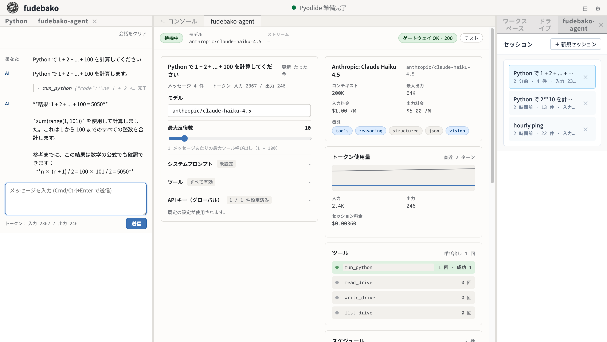

# fudebako-agent

[fudebako](https://github.com/jugoya-ai/fudebako) 向けの AI コーディングエージェントプラグイン。OpenRouter 経由でマルチプロバイダのチャットと、ブラウザ内 Python 実行 (Pyodide) / `/drive/` 仮想ファイルシステムを組み合わせたツール利用ループを提供します。単一 HTML ファイルで完結します。

## 重要 — データ送信および AI 出力に関する免責

> **エージェント有効化中はブラウザから外部へデータが送信されます。** 素の fudebako と異なり、本プラグインを利用するとプロンプトおよびエージェントが参照したツール出力 (`/drive/` 配下のファイル内容を含む) が OpenRouter (https://openrouter.ai) と、利用者が選択した上流プロバイダ (Anthropic / OpenAI / Google 等) に HTTPS で送信されます。これは「データはクライアントから出さない」という fudebako の方針に対する、**意図的な例外**です。
>
> 利用に際しては以下をご了解ください。詳細は [`TERMS.md`](TERMS.md) (日本語、正本) または [`LICENSE`](LICENSE) (英語、参考訳) を参照してください。
>
> - **第三者サービスの利用規約・課金は利用者責任**: OpenRouter および上流モデルプロバイダの利用規約・プライバシーポリシー・課金は、利用者と各サービス提供者との間で直接適用されます。著作者は中継・代理を行いません。
> - **API キーの自己管理**: `OPENROUTER_API_KEY` の取得・保管・失効は利用者責任です。鍵はブラウザ内 `/drive/` に保存され、配布物には含まれません。
> - **AI 出力の正確性は無保証**: エージェントの応答にはハルシネーション・誤情報・有害な出力が含まれる可能性があります。重要な意思決定への依拠は利用者責任で行ってください。
> - **ツール実行の副作用**: エージェントはモデルの判断に基づき `run_python` / `read_drive` / `write_drive` / `list_drive` 等を呼び出します。実行は Pyodide サンドボックスとブラウザストレージ境界内に限定されますが、利用者の `/drive/` データへの書き換え・削除を含む副作用が発生し得ます。
> - **スケジュール実行**: 指定時刻にブラウザタブ上で再実行されます。意図しないタイミングでの API 課金が発生し得ます。
> - **テレメトリ非収集**: 著作者は利用者からプロンプト・応答・ツール入出力・API キーを収集しません。ただし送信先サービスのログ・テレメトリ方針は当該サービス提供者の規約が適用されます。

## ダウンロード

[Releases ページ](https://github.com/jugoya-ai/fudebako-agent/releases/latest) から最新版の `fudebako-agent-vX.Y.Z.html` を取得してください。`NOTICES.txt` (第三者ライセンス全文) も各リリースに添付されています。

## 動作要件

| 項目 | 要件 |
|------|------|
| ブラウザ | Google Chrome / Microsoft Edge / Mozilla Firefox 最新版 |
| メモリ | 2 GB 以上推奨 |
| ファイルサイズ | 約 43 MB |
| ネットワーク | **起動時は不要**。ただし LLM 呼び出しには OpenRouter への到達性が必要 |
| API キー | [OpenRouter](https://openrouter.ai) のアカウント + API キー |

## 使い方

1. ダウンロードした HTML ファイルをダブルクリックし、既定のブラウザで開きます
2. 初回起動時は Python ランタイムの初期化に 20〜30 秒かかります。完了後「準備完了」と表示されます
3. 中央ペインの「API キー」カードで `OPENROUTER_API_KEY` を登録します
4. 左ペインのチャット欄にプロンプトを入力して送信します
5. モデル欄には OpenRouter のモデル ID を指定します (例: `anthropic/claude-haiku-4.5` / `openai/gpt-5` / `google/gemini-3.1-pro`)

## 主な機能

- **マルチプロバイダチャット** — OpenRouter 経由で複数の LLM プロバイダに接続
- **ツール利用ループ** — `run_python` / `read_drive` / `write_drive` / `list_drive` を組み合わせた ReAct 形式のタスク実行
- **セッション管理** — 会話履歴を `/drive/.fudebako-agent/history/` に自動保存、セッションごとの設定 (モデル / システムプロンプト / ツールフィルタ) に対応
- **ダッシュボード** — 現在モデル情報、トークン使用量、ツール別呼び出し統計、ゲートウェイ健全性
- **スケジューラ** — `at` (一度) / `every` (間隔) のジョブ登録とプロンプト自動実行、過去実行記録の閲覧

詳細なリリース内容は各 Release の説明を参照してください。

## ライセンス

- [**TERMS.md**](TERMS.md) — 利用規約 (日本語、正本)
- [**LICENSE**](LICENSE) — 英語参考訳 (齟齬がある場合は TERMS.md が優先)
- [**docs/THIRD_PARTY_LICENSES.md**](docs/THIRD_PARTY_LICENSES.md) — 同梱される第三者コンポーネントの一覧
- **NOTICES.txt** — 各 Release に添付。第三者ライセンスの全文を収録

本ソフトウェアは「現状有姿 (AS IS)」で提供されます。詳細は [TERMS.md](TERMS.md) をご確認ください。

## お問い合わせ

- 不具合報告・機能要望: [Issues](https://github.com/jugoya-ai/fudebako-agent/issues)
- 脆弱性報告: [SECURITY.md](SECURITY.md) を参照

---

Copyright © 2026 yonaka15. All rights reserved.
